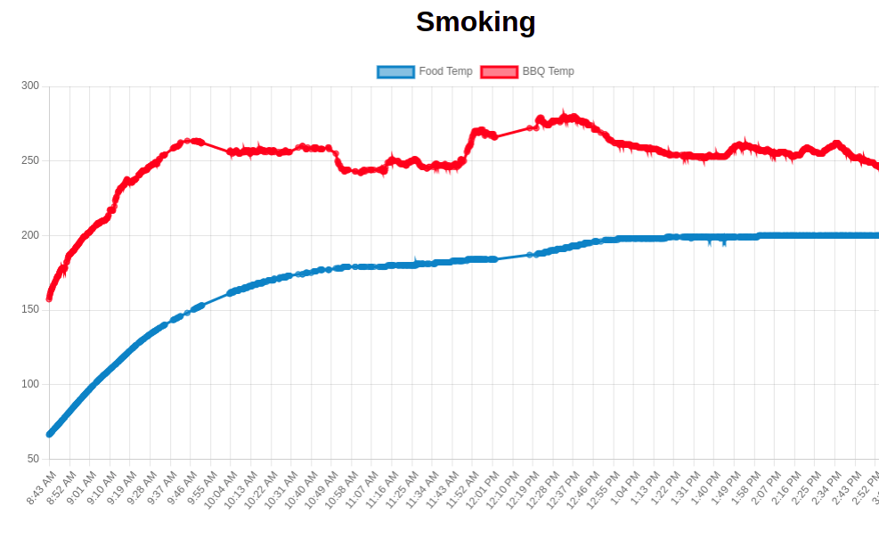

# Smoking Time

I had a ThermoPro (TP-08S) that I liked for smoking meats but it had one drawback: it was only able to display the current temp of the BBQ and food.  I often start up the bbq right before bed and I've always been curious to see what the temperature does overnight.  So, I thought maybe I could use my SDR setup to snoop on the temp transmitter and log the data.

I started setting up the SDR and then discovered the [rtl_433](https://github.com/merbanan/rtl_433) project which already has a setting for temp probe.  And that was the hardest part done.

This just sets up a dumb webpage that displays a ChartJS line graph for the temp of the bbq and food over time.  It then autoupdates current temps over websockets.

### Setting up your SDR
I have a NooElec NESDR Mini. I followed [this guide](https://www.nooelec.com/store/downloads/dl/file/id/72/product/294/nesdr_installation_manual_for_ubuntu.pdf).  You should really set up the user so you don't have to `sudo`.

Install `rtl_433` onto the box.  This is what we are using to read the SDR info from the Thermopro.

### Setting up the app
1. `nvm use`
2. `npm install`
3. copy the database: `cp db/temps.sample.db db/temps.db`
4. `npm start`

### Clean up old data
Just run `npm run clean`.  This will just delete old records from the database.